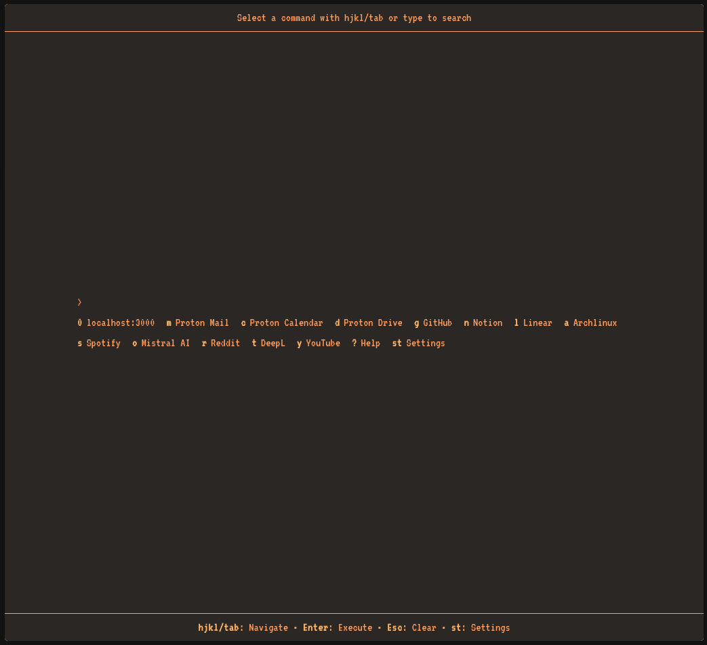

<p align="center">

</p>

<h1 align="center">surf~</h1>

*A keyboard-driven browser startpage*


## Description

surf~ is a minimal, keyboard-driven browser startpage.

## Main features

- **Keyboard navigation**: full hjkl and Tab navigation support
- **Quick shortcuts**: single-key access to favorite websites
- **Instant search**: type to search with DuckDuckGo (default one)
- **Multiple themes**: 18+ themes including Catppuccin, Rosé Pine, Neovim, and custom variants
- **Accessibility**: full keyboard accessibility with screen reader support
- **Responsive**: works on desktop and mobile devices
- **Pure**: pure HTML/CSS/JavaScript

## Installation

### Deploy with GitHub pages

The easiest way to host surf~ is using GitHub Pages:

1. **Fork the repository**:
   - Go to [github.com/results-may-vary-org/surf](https://github.com/results-may-vary-org/surf)
   - Click "Fork" in the top right corner

2. **Enable GitHub pages**:
   - In your forked repository, go to **Settings** → **Pages**
   - Under "Source", select **Deploy from a branch**
   - Choose **main** branch and **/ (root)** folder
   - Click **Save**

3. **Access your startpage**:
   - GitHub will provide a URL like: `https://yourusername.github.io/surf`
   - Set this as your browser homepage

### Local file access

For completely offline use:

1. **Download or clone** the repository
2. **Open `index.html`** directly in your browser
3. **Set as homepage**: Use `file:///path/to/surf/index.html`

⚠️ **Note**: Maybe some features may be limited when using `file://` protocol due to browser security restrictions.

## Usage

### Navigation

- **hjkl/Tab**: Navigate between commands and choices
- **Enter**: Execute selected command or search
- **Esc**: Clear input/exit modes
- **st**: Open settings
- **?**: Help/Documentation

### Input mode

- Type any text to search
- Multiple options show choices (use hjkl/Tab to navigate)
- Press Enter to execute search or selected choice
- The mouse also work

## Customization

Edit `script/script.js` to modify shortcuts:

```javascript
shortcuts: {
    'g': [
        { name: 'GitHub', url: 'https://github.com' }
    ],
    // Add your own shortcuts...
}
```

Themes can be selected in the settings panel (press `st`).

You can also add or remove theme via the `css/themes.css` file and by adding it to the list in `index.html`.

## Code of conduct, license, authors, changelog, contributing

See the following file :
- [code of conduct](CODE_OF_CONDUCT.md)
- [license](LICENSE)
- [authors](AUTHORS)
- [contributing](CONTRIBUTING.md)
- [changelog](CHANGELOG)
- [security](SECURITY.md)

## Want to participate? Have a bug or a request feature?

Do not hesitate to open a pr or an issue. I reply when I can.

## Support

If you find surf~ useful, consider:

- Starring the repository
- Reporting issues
- Sharing with others
- Contributing code or documentation

## Want to support my work?

- [Give me a tips](https://ko-fi.com/a2n00)
- [Give a star on github](https://github.com/results-may-vary-org/surf)
- Or just participate to the developement :D

### Thanks !
